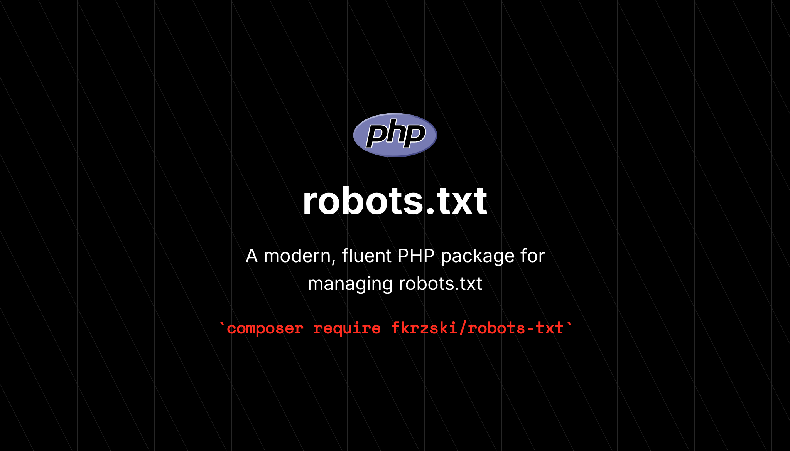

<p style="display: flex; align-items: center; gap: 10px; flex-wrap: wrap; justify-content: center;">



</p>

------

# PHP Robots.txt

A modern, fluent PHP package for building valid `robots.txt` files with type-safe
crawlers and fail-fast validation. Invalid paths, sitemap URLs, or crawl delays
throw a clear exception as you build — never a broken file at render time.

## Requirements

- PHP 8.4 or higher
- A code coverage driver (development only)

## Installation

```bash
composer require fkrzski/robots-txt
```

## Quick start

Chain rules and render the result with `toString()`:

```php
use Fkrzski\RobotsTxt\RobotsTxt;

$robots = new RobotsTxt();

echo $robots
    ->disallow('/admin')
    ->allow('/public')
    ->crawlDelay(5)
    ->toString();
```

```text
User-agent: *
Disallow: /admin
Allow: /public
Crawl-delay: 5
```

Target a specific crawler with `userAgent()` (or the closure-based
`forUserAgent()`), and write the file to disk with `toFile()`:

```php
use Fkrzski\RobotsTxt\Enums\CrawlerEnum;

(new RobotsTxt())
    ->disallow('/admin')
    ->sitemap('https://example.com/sitemap.xml')
    ->forUserAgent(CrawlerEnum::GOOGLE, function (RobotsTxt $robots): void {
        $robots->disallow('/private')->crawlDelay(10);
    })
    ->toFile(); // writes ./robots.txt
```

## Documentation

Full documentation is hosted at **[docs.fkrzski.dev/robots-txt](./robots-txt)**:

- **[Guide](./robots-txt/guide)** — how global and crawler-specific rules compose, output order, and writing to disk.
- **[API reference](./robots-txt/api-reference)** — every method with its signature, validation rules, and verified output.
- **[Crawlers](./robots-txt/crawlers)** — the full `CrawlerEnum` list mapped to official user-agent strings.

## Contributing

Contributions are welcome — see the [Contributing Guide](.github/CONTRIBUTING.md).
Run the full test and quality suite with:

```bash
composer test
```

## License

Open-sourced software licensed under the [MIT License](LICENSE.md).

## Author

**PHP Robots.txt** was created by [Filip Krzyżanowski](https://linkedin.com/in/fkrzski).
